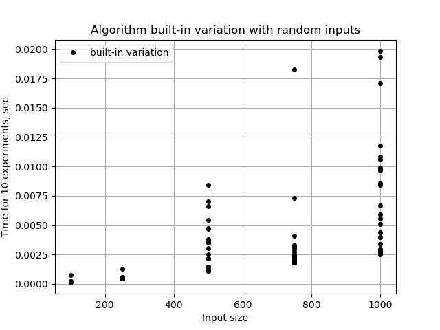
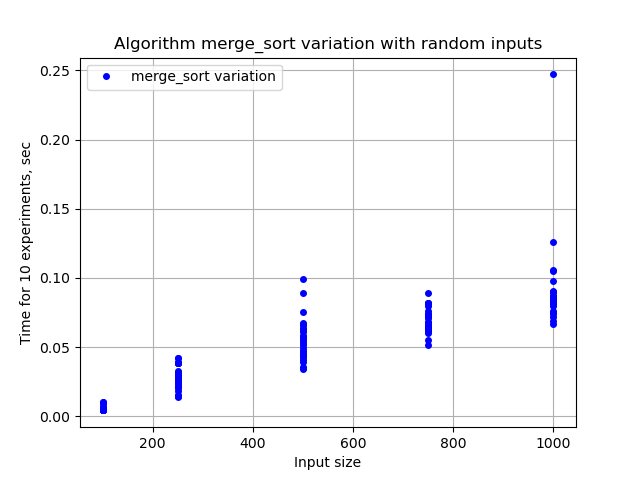
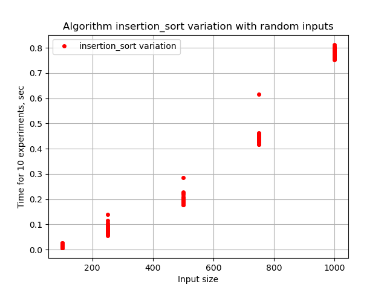
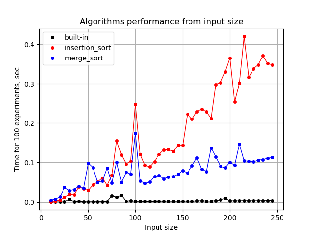
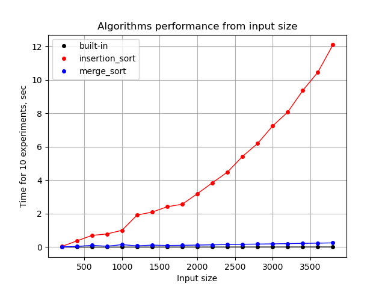
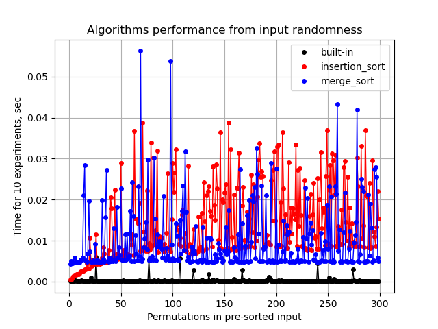
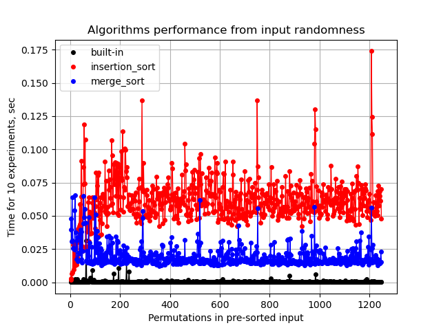
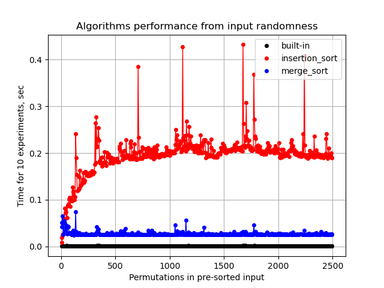
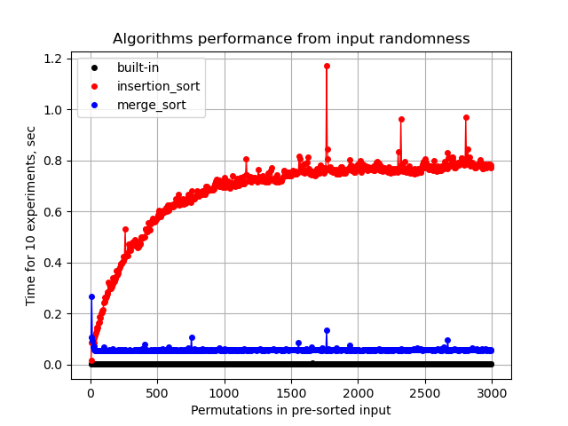

## Теорія

Теоретична складність сортування вставкою (Insertion sort) - О(n^2)

Теоретична складність сортування злиттям (Merge Sort) - O(n*log(n))

Еталонна реалізація алгоритму у вбудованій функції має бути помітно швидше наївних самописних реалізацій.

## Практика

Експеримент проводився на віртуальній машині 2 CPU, 4GB RAM, на якій запущено лише середовище розробки VSCode.
Проте на результати виміру могли вплинути системні процеси, кешування результатів тощо. Тому доцільно виконувати декілька однакових експериментів з однаковими вхідними даними і потім усереднювати результат.

### Експеримент 1: Оцінка того, наскільки швидкодія залежить від випадкової комбінації вхідних даних

Для кожного алгоритму для різного розміру вхідних даних беремо по 30 випадково згенерованих масивів вхідних даних. 

Файл з кодом: [exp01_variation.py](./exp01_variation.py)

#### Для вбудованого алгоритму сортування:

[Таблиця результатів у текстовому вигляді](./textfiles/built-in_variation.md)

#### Для алгоритму сортування злиттям:

[Таблиця результатів у текстовому вигляді](./textfiles/merge_sort_variation.md)

#### Для алгоритму сортування вставкою:

[Таблиця результатів у текстовому вигляді](./textfiles/insertion_sort_variation.md)

**Висновок**: швидкодія алгоритма залежить від конкретних вхідних даних, але тенденції можна помітити для всіх трьох алгоритмів.

### Експеримент 2: Швидкодія для вхідних даних невеликих розмірів

Для невеликих розмірів випадково згенерованих вхідних даних вже видно тенденції зростання складності кожного з алгоритмів.

Файл з кодом: [exp02_small_inputs.py](./exp02_small_inputs.py)

[Таблиця результатів у текстовому вигляді](./textfiles/small_input_size.md)

### Експеримент 3: Швидкодія для вхідні дані більших розмірів

Для більших розмірів випадково згенерованих вхідних даних суттєво вирізняється сортування вставкою порівняно з іншими двома варіантами.

Файл з кодом: [exp03_big_inputs.py](./exp03_big_inputs.py)

[Таблиця результатів у текстовому вигляді](./textfiles/big_input_size.md)

### Експеримент 4: Залежність від початкової відсортованості вхідних даних

На самому початку генеруємо повністю відсортований масив даних. Далі поступово перемішуємо випадкові елементи та знову відсортовуємо всіма трьома алгоритмами.

Файл з кодом: [exp04_input_randomness.py](./exp04_input_randomness.py)

#### Для вхідного масива на 100 елементів:

[Таблиця результатів у текстовому вигляді](./textfiles/100_permutations.md)

#### Для вхідного масива на 250 елементів:

[Таблиця результатів у текстовому вигляді](./textfiles/250_permutations.md)

#### Для вхідного масива на 500 елементів:

[Таблиця результатів у текстовому вигляді](./textfiles/500_permutations.md)

#### Для вхідного масива на 1000 елементів:

[Таблиця результатів у текстовому вигляді](./textfiles/1000_permutations.md)

**Висновок**: Для вбудованого алгоритму та алгоритму сортування злиттям відсортованість вхідних даних не грає ролі. Для алгоритму сортування вставками відсортованість суттєво впливає на кількість перестановок, які необхідно зробити.

## Висновки

1. Теоретична асимптотична складність алгоритмів сортування підтверджується практикою.
1. Вбудована бібліотечна реалізація алгоритма оптимізована значно краще, ніж наївні самописні реалізації.
1. Іноді алгоритм з гіршою теоретичною складністю працює швидше інших на вхідних даних невеликого розміру або на вхідних даних з певними характеристиками (наприклад, попередньою впорядкованістю).
1. Серед порівнюваних алгоритмів тільки на швидкодію сортування перестановками суттєво впливає ступінь відсортованісті вхідних даних, щообумовлено самоїю логікою алгоритма.

