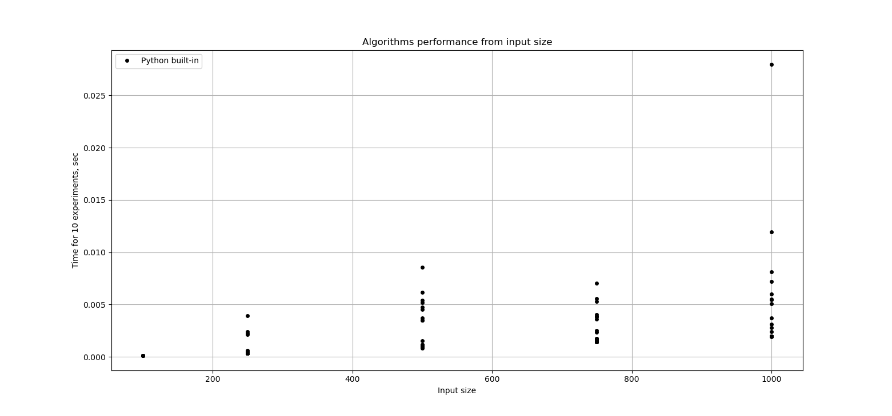

## Теорія

Теоретична складність сортування вставкою (Insertion sort) - О(n^2)

Теоретична складність сортування злиттям (Merge Sort) - O(n*log(n))

Еталонна реалізація алгоритму у вбудованій функції має бути помітно швидше наївних самописних реалізацій.

## Практика

Експеримент проводився на віртуальній машині 2 CPU, 4GB RAM, на якій запущено лише середовище розробки VSCode.
Проте на результати виміру могли вплинути системні процеси, кешування результатів тощо. Тому доцільно виконувати декілька однакових експериментів з однаковими вхідними даними і потім усереднювати результат.

### Експеримент 1: Оцінка того, наскільки швидкодія залежить від випадкової комбінації вхідних даних

Для кожного алгоритму для різного розміру вхідних даних беремо по 30 випадково згенерованих масивів вхідних даних. 

Файл з кодом: [exp01_variation.py](./exp01_variation.py)

#### Для вбудованого алгоритму сортування:

[Таблиця результатів у текстовому вигляді](./textfiles/built-in_variation.md)

#### Для алгоритму сортування злиттям:

[Таблиця результатів у текстовому вигляді](./textfiles/merge_sort_variation.md)

**Висновок**: швидкодія алгоритма залежить від конкретних вхідних даних, але тенденції можна помітити для всіх трьох алгоритмів.

#### Для алгоритму сортування вставкою:

[Таблиця результатів у текстовому вигляді](./textfiles/insertion_sort_variation.md)

### Експеримент 1: малі вхідні дані (task01_small_inputs.py)

Для невеликих розмірів випадково згенерованих вхідних даних вже видно тенденції зростання складності кожного з алгоритмів.

<b>Таблиця з результатами експерименту.</b>

У таблиці наведено сумарний час виконання 100 сортувань для кожного з алгоритмів та розміру вхідних даних.

| Input size | Insertion sort | Merge sort | Built-in |
| ---- | ---- | ---- | ---- |
| 10 | 0.00093 | 0.00300 | 0.00011 |
| 20 | 0.00344 | 0.00689 | 0.00019 |
| 30 | 0.00818 | 0.01196 | 0.00029 |
| 40 | 0.01566 | 0.04190 | 0.00044 |
| 50 | 0.03251 | 0.02558 | 0.00058 |
| 60 | 0.02947 | 0.02509 | 0.00072 |
| 70 | 0.03583 | 0.03351 | 0.00079 |
| 80 | 0.05609 | 0.03906 | 0.00139 |
| 90 | 0.06594 | 0.04047 | 0.00117 |
| 100 | 0.07222 | 0.04875 | 0.00116 |
| 110 | 0.09036 | 0.05145 | 0.00144 |
| 120 | 0.10852 | 0.05362 | 0.00148 |
| 130 | 0.11955 | 0.06819 | 0.00157 |
| 140 | 0.16695 | 0.07973 | 0.00190 |
| 150 | 0.18539 | 0.09243 | 0.00222 |
| 160 | 0.22729 | 0.08503 | 0.00320 |
| 170 | 0.20795 | 0.08250 | 0.00259 |
| 180 | 0.22981 | 0.09719 | 0.00230 |
| 190 | 0.23489 | 0.08454 | 0.00232 |
| 200 | 0.26216 | 0.09024 | 0.00282 |
| 210 | 0.27794 | 0.09414 | 0.00275 |
| 220 | 0.30707 | 0.10143 | 0.00280 |
| 230 | 0.35929 | 0.10448 | 0.00693 |
| 240 | 0.37357 | 0.11069 | 0.00323 |

### Експеримент 2: більші вхідні дані (task01_big_input.py)

Для більших розмірів випадково згенерованих вхідних даних суттєво вирізняється сортування вставкою порівняно з іншими двома варіантами.

<b>Таблиця з результатами експерименту.</b>

У таблиці наведено сумарний час виконання 10 сортувань для кожного з алгоритмів та розміру вхідних даних.

| Input size | Insertion sort | Merge sort | Built-in |
| ---- | ---- | ---- | ---- |
| 250 | 0.04580 | 0.01351 | 0.00058 |
| 500 | 0.26694 | 0.02876 | 0.00092 |
| 750 | 0.57722 | 0.05154 | 0.00171 |
| 1000 | 1.00551 | 0.08576 | 0.00248 |
| 1250 | 1.69667 | 0.10593 | 0.00311 |
| 1500 | 2.86429 | 0.12021 | 0.00413 |
| 1750 | 2.81101 | 0.12345 | 0.01117 |
| 2000 | 3.24296 | 0.12004 | 0.00509 |
| 2250 | 3.97696 | 0.14040 | 0.00541 |
| 2500 | 4.90802 | 0.15844 | 0.00581 |
| 2750 | 5.96517 | 0.17456 | 0.00700 |
| 3000 | 7.25622 | 0.19186 | 0.00709 |
| 3250 | 8.25361 | 0.21120 | 0.00806 |
| 3500 | 9.89310 | 0.23061 | 0.01048 |
| 3750 | 10.88850 | 0.24482 | 0.00946 |

### Експеримент 3: залежність від розподілу вхідних даних

<b>Таблиця з результатами експерименту.</b>

У таблиці наведено сумарний час виконання 10 сортувань для кожного розміру вхідних даних для 20 різних випадково згенерованих масивів.

| Input size | Built-in |
| ---- | ---- |
| 100 | 0.00013, 0.00013, 0.00012, 0.00012, 0.00012, 0.00014, 0.00012, 0.00012, 0.00011, 0.00013, 0.00011, 0.00012, 0.00012, 0.00012, 0.00012, 0.00012, 0.00012, 0.00014, 0.00012, 0.00012 |
| 250 | 0.00037, 0.00038, 0.00036, 0.00036, 0.00036, 0.00037, 0.00239, 0.00036, 0.00036, 0.00036, 0.00038, 0.00036, 0.00056, 0.00036, 0.00036, 0.00392, 0.00036, 0.00213, 0.00062, 0.00223 |
| 500 | 0.00520, 0.00619, 0.00088, 0.00099, 0.00152, 0.00118, 0.00092, 0.00113, 0.00115, 0.00856, 0.00349, 0.00350, 0.00085, 0.00109, 0.00116, 0.00543, 0.00476, 0.00454, 0.00098, 0.00369 |
| 750 | 0.00251, 0.00177, 0.00555, 0.00360, 0.00387, 0.00380, 0.00174, 0.00530, 0.00145, 0.00141, 0.00142, 0.00140, 0.00140, 0.00702, 0.00233, 0.00165, 0.00143, 0.00164, 0.00169, 0.00403 |
| 1000 | 0.01194, 0.00312, 0.02795, 0.00281, 0.00196, 0.00811, 0.00196, 0.00505, 0.00196, 0.00195, 0.00198, 0.00194, 0.00550, 0.00544, 0.00601, 0.00196, 0.00242, 0.00722, 0.00197, 0.00372 |

## Висновки

