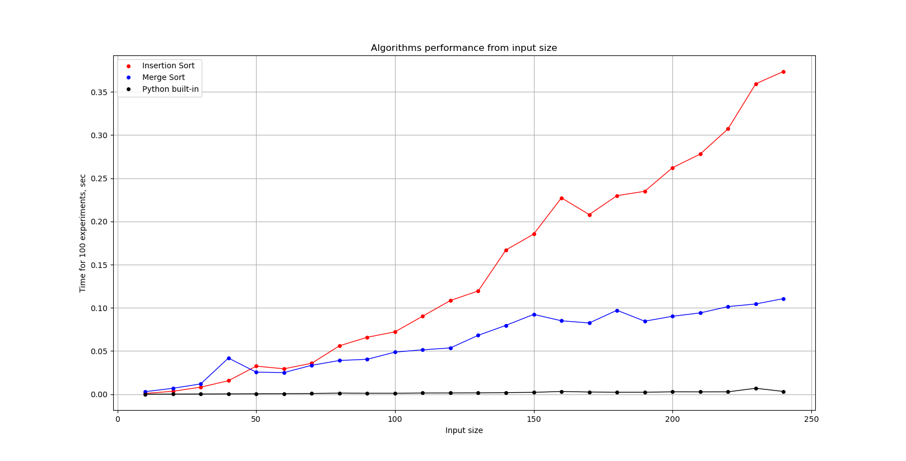

# Експеримент 1: малі вхідні дані

| Input size | Insertion sort | Merge sort | Built-in |
| ---- | ---- | ---- | ---- |
| 10 | 0.00093 | 0.00300 | 0.00011 |
| 20 | 0.00344 | 0.00689 | 0.00019 |
| 30 | 0.00818 | 0.01196 | 0.00029 |
| 40 | 0.01566 | 0.04190 | 0.00044 |
| 50 | 0.03251 | 0.02558 | 0.00058 |
| 60 | 0.02947 | 0.02509 | 0.00072 |
| 70 | 0.03583 | 0.03351 | 0.00079 |
| 80 | 0.05609 | 0.03906 | 0.00139 |
| 90 | 0.06594 | 0.04047 | 0.00117 |
| 100 | 0.07222 | 0.04875 | 0.00116 |
| 110 | 0.09036 | 0.05145 | 0.00144 |
| 120 | 0.10852 | 0.05362 | 0.00148 |
| 130 | 0.11955 | 0.06819 | 0.00157 |
| 140 | 0.16695 | 0.07973 | 0.00190 |
| 150 | 0.18539 | 0.09243 | 0.00222 |
| 160 | 0.22729 | 0.08503 | 0.00320 |
| 170 | 0.20795 | 0.08250 | 0.00259 |
| 180 | 0.22981 | 0.09719 | 0.00230 |
| 190 | 0.23489 | 0.08454 | 0.00232 |
| 200 | 0.26216 | 0.09024 | 0.00282 |
| 210 | 0.27794 | 0.09414 | 0.00275 |
| 220 | 0.30707 | 0.10143 | 0.00280 |
| 230 | 0.35929 | 0.10448 | 0.00693 |
| 240 | 0.37357 | 0.11069 | 0.00323 |

