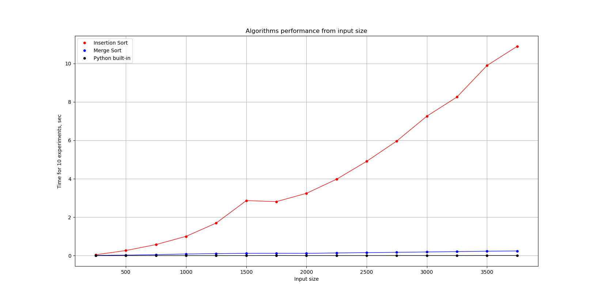

# Теорія

Теоретична складність сортування вставкою (Insertion sort) - О(n^2)

Теоретична складність сортування злиттям (Merge Sort) - O(n*log(n))

Еталонна реалізація алгоритму у вбудованій функції має бути помітно швидше наївних самописних реалізацій.

# Експеримент 1: малі вхідні дані (task01_small_inputs.py)

Для невеликих розмірів випадково згенерованих вхідних даних вже видно тенденції зростання складності кожного з алгоритмів.

<b>Таблиця з результатами експерименту.</b>

| Input size | Insertion sort | Merge sort | Built-in |
| ---- | ---- | ---- | ---- |
| 10 | 0.00093 | 0.00300 | 0.00011 |
| 20 | 0.00344 | 0.00689 | 0.00019 |
| 30 | 0.00818 | 0.01196 | 0.00029 |
| 40 | 0.01566 | 0.04190 | 0.00044 |
| 50 | 0.03251 | 0.02558 | 0.00058 |
| 60 | 0.02947 | 0.02509 | 0.00072 |
| 70 | 0.03583 | 0.03351 | 0.00079 |
| 80 | 0.05609 | 0.03906 | 0.00139 |
| 90 | 0.06594 | 0.04047 | 0.00117 |
| 100 | 0.07222 | 0.04875 | 0.00116 |
| 110 | 0.09036 | 0.05145 | 0.00144 |
| 120 | 0.10852 | 0.05362 | 0.00148 |
| 130 | 0.11955 | 0.06819 | 0.00157 |
| 140 | 0.16695 | 0.07973 | 0.00190 |
| 150 | 0.18539 | 0.09243 | 0.00222 |
| 160 | 0.22729 | 0.08503 | 0.00320 |
| 170 | 0.20795 | 0.08250 | 0.00259 |
| 180 | 0.22981 | 0.09719 | 0.00230 |
| 190 | 0.23489 | 0.08454 | 0.00232 |
| 200 | 0.26216 | 0.09024 | 0.00282 |
| 210 | 0.27794 | 0.09414 | 0.00275 |
| 220 | 0.30707 | 0.10143 | 0.00280 |
| 230 | 0.35929 | 0.10448 | 0.00693 |
| 240 | 0.37357 | 0.11069 | 0.00323 |

# Експеримент 2: більші вхідні дані (task01_big_input.py)

Для більших розмірів випадково згенерованих вхідних даних суттєво вирізняється сортування вставкою порівняно з іншими двома варіантами.

<b>Таблиця з результатами експерименту.</b>

| Input size | Insertion sort | Merge sort | Built-in |
| ---- | ---- | ---- | ---- |
| 250 | 0.04580 | 0.01351 | 0.00058 |
| 500 | 0.26694 | 0.02876 | 0.00092 |
| 750 | 0.57722 | 0.05154 | 0.00171 |
| 1000 | 1.00551 | 0.08576 | 0.00248 |
| 1250 | 1.69667 | 0.10593 | 0.00311 |
| 1500 | 2.86429 | 0.12021 | 0.00413 |
| 1750 | 2.81101 | 0.12345 | 0.01117 |
| 2000 | 3.24296 | 0.12004 | 0.00509 |
| 2250 | 3.97696 | 0.14040 | 0.00541 |
| 2500 | 4.90802 | 0.15844 | 0.00581 |
| 2750 | 5.96517 | 0.17456 | 0.00700 |
| 3000 | 7.25622 | 0.19186 | 0.00709 |
| 3250 | 8.25361 | 0.21120 | 0.00806 |
| 3500 | 9.89310 | 0.23061 | 0.01048 |
| 3750 | 10.88850 | 0.24482 | 0.00946 |

# Висновки

